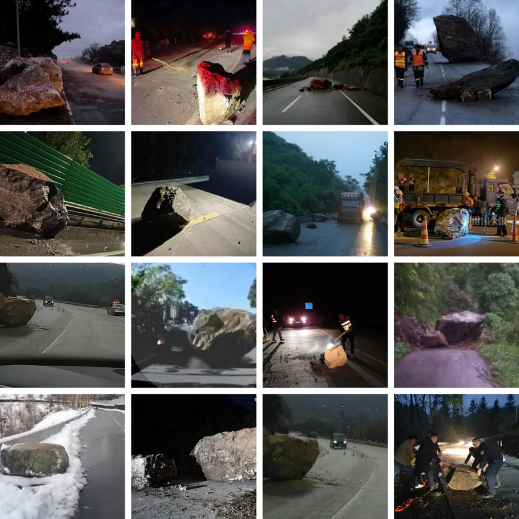

# Mountain Rockfall Dataset (MRDataset)

[](https://creativecommons.org/licenses/by/4.0/)
[]()
[]()

> ⚠️ **Important Notice: Delayed Data Release**
> 
> This dataset is currently in pre-release stage. The complete dataset will be publicly available upon the formal acceptance of our associated academic paper.

## Dataset Overview

MRDataset is a high-quality computer vision dataset specifically designed for rockfall disaster detection, addressing the critical lack of annotated image data in this domain.



### Key Features
- **Total Images**: 3,921 real-world rockfall disaster images
- **Annotated Instances**: 12,314 precisely labeled rockfall samples
- **Scene Diversity**: Includes various challenging environments with illumination variations, rain/fog interference, and motion blur
- **Object Characteristics**: Covers small objects, large volumes, and elongated rock shapes
- **Data Splits**: Training set (3,126), validation set (425), test set (411) in 8:1:1 ratio

## 📜 Legal Disclaimer and Usage Terms

**Please read this section carefully before using the dataset.**

### Image Sources and Copyright
- The images in this dataset were collected from various **publicly accessible online sources** including social media platforms, news websites, and public databases.
- We do not claim copyright ownership over the original images. The copyright remains with the respective original creators and rights holders.
- This collection has been compiled for **academic research and non-commercial purposes** only, under the doctrine of fair use.

### License Scope
- The **CC BY 4.0 license** applies to:
  - Our **original annotations** (bounding boxes, labels, metadata)
  - The **dataset structure and organization**
  - Documentation and code provided with this repository
- The license does not override the original copyright status of the images themselves.

### Usage Restrictions
- This dataset is intended **solely for academic research and educational purposes**.
- Commercial use of this dataset is **not permitted** without appropriate licensing from the original copyright holders.
- Users of this dataset assume all responsibility for ensuring their use complies with applicable copyright laws in their jurisdiction.

## Currently Available Resources

During the pre-release period, we provide the following resources:

### Available Now
- ✅ Detailed dataset documentation
- ✅ Annotation format specification
- ✅ Sample images (limited subset)

### Coming Soon
- 🔄 Complete image dataset
- 🔄 Full annotation files
- 🔄 Evaluation scripts and benchmark results

## Access Request

### For Academic Research
If you require immediate access to the dataset for academic research purposes:
1. Email us at [murans@foxmail.com]
2. Provide your institutional affiliation and research proposal
3. Agree not to redistribute the data prior to our paper publication
4. Confirm that you will use the dataset only for non-commercial research purposes

### For Commercial Use
Please contact us to discuss licensing arrangements. Note that commercial use may require additional permissions from original copyright holders.

<!-- ## Citation

If you use this dataset in your research, please cite our paper:

```bibtex
@article{author2024mrdataset,
  title={MRDataset: A Large-Scale Mountain Rockfall Detection Dataset},
  author={Author Names},
  journal={Under Review},
  year={2024}
} -->