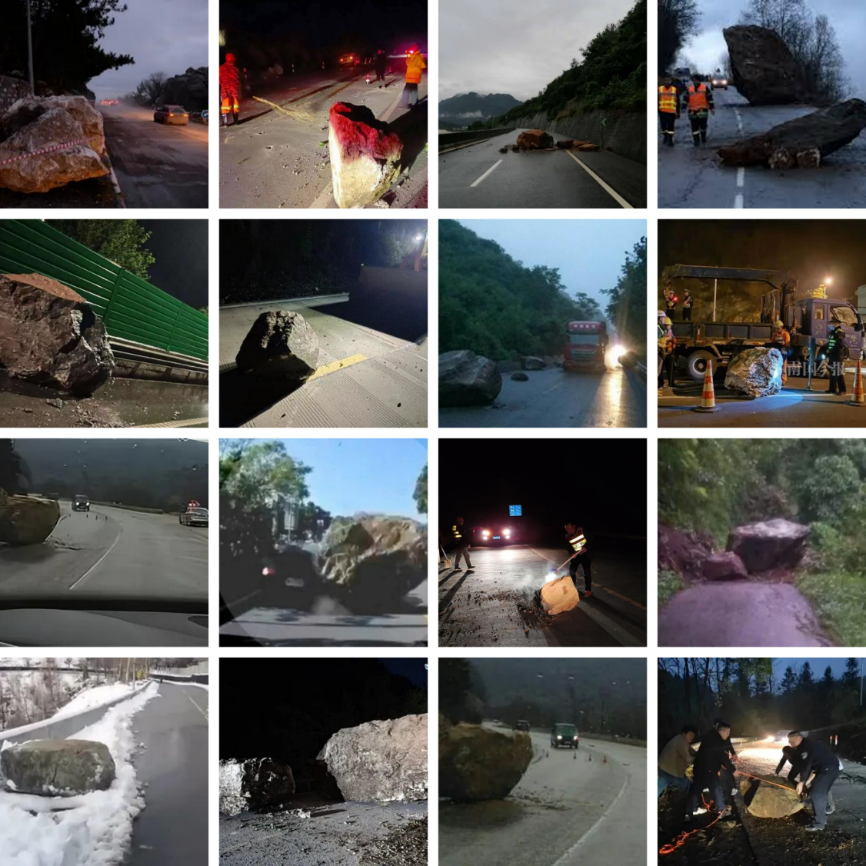

# Mountain Rockfall Dataset (MRDataset)

[](https://creativecommons.org/licenses/by/4.0/)
[](https://pan.baidu.com/s/1uHoCB277q8kHexxjnYLFAw?pwd=5bks)
[](https://doi.org/10.1007/s10346-025-02683-9)
[](https://doi.org/10.1007/s10346-025-02683-9)

## Dataset Overview

The **Mountain Rockfall Dataset (MRDataset)** is a high-quality computer vision dataset designed for **mountain rockfall disaster detection**. It addresses the long-standing shortage of annotated real-world image data for rockfall monitoring in complex mountainous environments.

MRDataset provides diverse and challenging rockfall scenes for model training, evaluation, and benchmarking in object detection and related vision tasks. The dataset is now **fully open-sourced and publicly available**, including all image files and complete annotation files.



---

## Key Features

- **Total Images**: 3,921 real-world rockfall disaster images
- **Annotated Instances**: 12,314 precisely labeled rockfall samples
- **Scene Diversity**:
  - Complex terrain backgrounds
  - Illumination variations
  - Rain, fog, and atmospheric interference
  - Motion blur and occlusion
- **Object Characteristics**:
  - Small-scale rockfall targets
  - Large-volume rock masses
  - Elongated and irregular rock shapes
- **Data Splits**:
  - Training set: 3,126 images
  - Validation set: 425 images
  - Test set: 411 images
  - Split ratio: **8 : 1 : 1**

---

## Dataset Contents

The full dataset release includes:

- ✅ **All image files**
- ✅ **Complete annotation files**
- ✅ **Annotation format specification**
- ✅ **Dataset documentation**
- ✅ **Sample visualization figures**

---

## Annotation Format

- Object-level bounding box annotations
- Single-class label: `rockfall`
- Compatible with common object detection frameworks, especially YOLO-style detection pipelines
- Detailed format description is provided in the documentation directory

---

## Access and Usage

The dataset is **fully released and publicly available**.

- **Download link**: https://pan.baidu.com/s/1uHoCB277q8kHexxjnYLFAw?pwd=5bks
- **Extraction code**: `5bks`

Researchers may download and use MRDataset for **non-commercial academic research and educational purposes**. When redistributing or referencing the dataset, please retain the license information, legal disclaimer, and citation information provided in this README.

---


## Citation

If you use MRDataset or find it helpful for your research, please cite the following paper:

```bibtex
@article{Liu2026EENet,
  title   = {EENet: An edge-enhanced network for robust rockfall detection in complex mountainous environments},
  author  = {Liu, Hongbing and Zhang, Mingjin and Zhuang, Shenghan and Chen, Kunping and Zhang, Jinxiang},
  journal = {Landslides},
  volume  = {23},
  number  = {4},
  pages   = {989--1004},
  year    = {2026},
  doi     = {10.1007/s10346-025-02683-9},
  url     = {https://doi.org/10.1007/s10346-025-02683-9}
}
```

---

## Legal Disclaimer and Usage Terms

**Please read this section carefully before using the dataset.**

### Image Sources and Copyright

- Images were collected from **publicly accessible online sources**, including:
  - News websites
  - Social media platforms
  - Public image databases
- We **do not claim copyright ownership** of the original images.
- Copyright remains with the respective original authors or rights holders.

### License Scope

The **CC BY 4.0 license** applies to:

- Original **annotations** including bounding boxes, labels, and metadata
- Dataset **structure and organization**
- Documentation and any accompanying code

⚠️ The license **does not override** the original copyright status of the images themselves.

### Usage Restrictions

- The dataset is intended for **academic research and educational purposes**.
- **Commercial use is not permitted** without appropriate authorization from the original copyright holders.
- Users are responsible for ensuring compliance with local copyright laws and regulations.

---

## Contact

For questions about MRDataset, please refer to the related paper or contact the corresponding author through the publication page.
